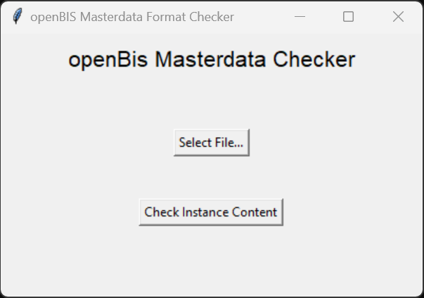
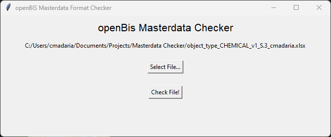
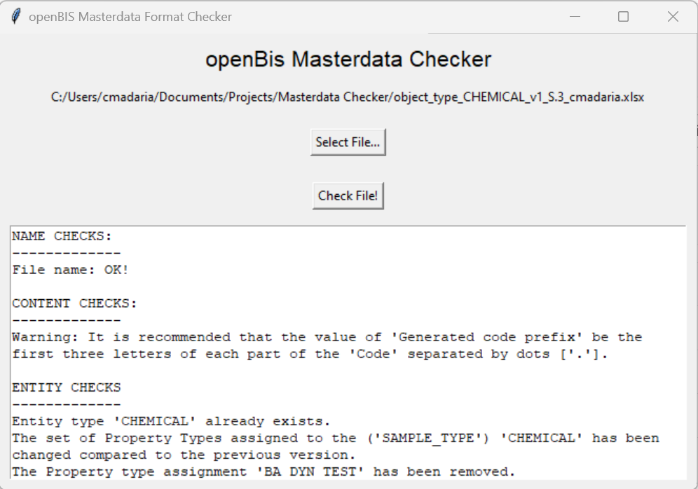
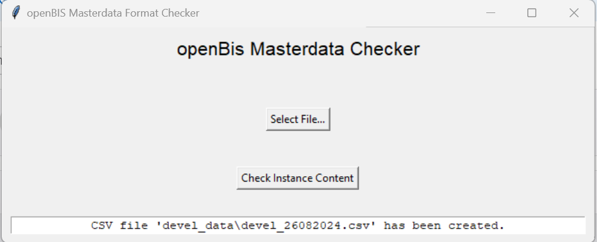
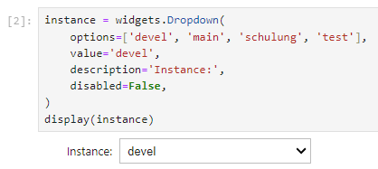
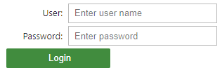
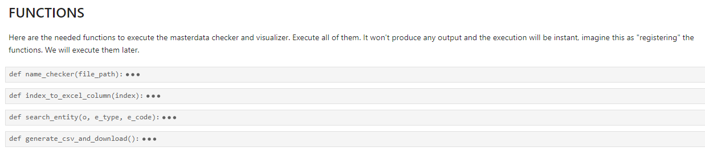
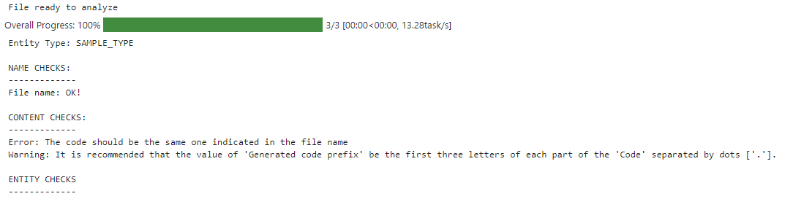
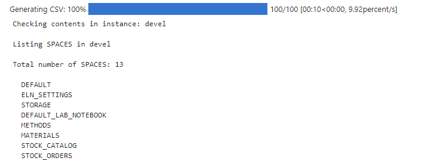

# Masterdata Checker & Visualizer

Check the correctness and alignment with the BAM Data Store Project guidelines of the new entities before registering them in openBIS, through the Import utility using Excel files containing the new Objects data. 

With a clear and easy interface, and a detailed list of every present issue in the Excel files, it allows you to correct your new objects and to avoid losing time.

It is also possible to visualize the whole content of the desired openBIS instances, as long as we have credentials to access them, to check the metadata already present on the selected instance.

There is also available a Jupyter Notebook version to execute the Masterdata Checker and Visualizer directly in the Web IDE.

## Requirements
- ([Python3](https://www.python.org/downloads/))

Once that you have installed latest Python version, you can use the ``pip`` command to install the following dependencies (both in your command line (cmd) or directly in a Jupyter Notebook):
- pyBIS: ``pip install pybis``
- pandas: ``pip install pandas``
- regex: ``pip install re``

Those are the basic packages that you will need.

Now, depending on the version that you are going to use, you need to install the following packages (although probably most of them will be already installed within your Python installation, but just in case that you receive any error with some of the packages, here you have the way of installing them):

*For the Web IDE version (Jupyer Notebook)*:
- ``pip install jupyterlab`` // ``pip install notebook`` (choose one, information about [here](https://jupyter.org/install))
- CSV: ``pip install csv``
- OS: ``pip install os``
- Python Widgets: ``pip install ipywidgets``
- Time: ``pip install time``
- Tempfile: ``pip install tempfile``

*For the local UI (User Interface)*:
- TKInter: ``pip install tkinter``
- OpenPyXL: ``pip install openpyxl``

## Installation
Once that you have fulfilled all the requirements above, no more installation is needed, you can just run the main script to start using it:

First, clone or download the repository code (and unzip it in case is compressed).
Then, go to the main project folder an do the following:

From command line:
- ``python masterdata_checker.py``

From Jupyter Notebooks:
- ``jupyter-notebook`` (on the command line)
- Open the file *jupyter_checker/checker_jupyter.ipynb*

## Usage

### Local Application: Checking a file

1- Inside the main project folder, run the following in the command line (cmd): ``python masterdata_checker.py "username" "instancename"``, where you will need to replace "username" by your username in openBIS (for example, johndoe), and "instancename" by the name o the intance where you want to work with (for example, main).

2- A prompt will appear asking for your password for the introduced username in the indicated instance. The password will not appear meanwhile you write it, to keep it private, but as soon as you are finish, click Enter, and if al the data is correct, the GUI will follow.

3- This interface will appear, click on "Select File...".

4- A File Explorer window will appear, select the desired file and click on "Open".

5- Now, click on "Check File!", and wait a few seconds, until a text field with all the instance information appear.

### Local Application: Visualizing instance content

1- Inside the main project folder, run the following in the command line (cmd): ``python masterdata_checker.py "username" "instancename"``, where you will need to replace "username" by your username in openBIS (for example, johndoe), and "instancename" by the name o the intance where you want to work with (for example, main).

2- A prompt will appear asking for your password for the introduced username in the indicated instance. The password will not appear meanwhile you write it, to keep it private, but as soon as you are finish, click Enter, and if al the data is correct, the GUI will follow.

3- This interface will appear, click on ""Check Instance Content".

4- Now wait a few seconds, until a message indicating that a CSV file was created. This file will be located in the same location where you are executing the script, with name of the instance, an underscore "_", and the day of execution. It will contain all the instance Masterdata information (types for every entity, object properties by type, ...) 

### Jupyter Notebook Web IDE

1- Run ``jupyter-lab`` or ``jupyter-notebook`` on the folder where the jupyter_checker is located, using the command line (depending on what you have installed).

2- On the left side, select the file *checker_jupyter.ipynb*, and double click to open it.

3- Once the notebook is open, execute the first code cells: the one containing all the imports, and then the cell for selecting the openBIS instance. A dropdown list will appear containing all the available openBIS instances; select the desired one.

4- Then, run the cell for entering username and password. Two text fields for entering this information and a button called "Login" should appear. Enter your information and click on it. If everything went well, you will see "Login sucessful!".

***NOTE***: You will see another cell below the login tool, execute it just if the login fails for any reason using the login tool. It will take the username and password entered in the login tool, and do the login manually by script instead of using the button (that sometimes can fail).

5- Now you will see the "FUNCTIONS" section. Here, you should execute all the cells that you can see (the cells will be collapsed, but you can extend them if you want just clicking on them), because there are the functions for the checker and visualizer. Run all the cell codes until you get to the section "USE THE CHECKER".

6- (Just follow this step and the next one in case that you want to use the Masterdata Checker. In case that you want to execute the Visualizer, go directly to step 8). Execute the cell that goes after "UPLOAD THE EXCEL FILE". An *Upload* button will appear. Click on it, and upload the Excel file with the entity where you want to check the Masterdata.

7- Finally, using the next cell will run the checker. A loading bar will appear with the different procesess, and once that it finishes, all the checks will appear below.

8- For running the Visualizer, steps 6 and 7 are not needed. Just run the cell below the section "USE THE VISUALIZER", and you will see a loading bar. When it finishes, you will see the instance content (in Masterdata terms), and together with it, a CSV file will be generated in the same location of the notebook, in a folder determined by the instance, named with instace and generation date. Example directory and file name: *devel_data/devel_28082024*.

## Support
Tell people where they can go to for help. It can be any combination of an issue tracker, a chat room, an email address, etc.

## Roadmap
If you have ideas for releases in the future, it is a good idea to list them in the README.

## Contributing
State if you are open to contributions and what your requirements are for accepting them.

For people who want to make changes to your project, it's helpful to have some documentation on how to get started. Perhaps there is a script that they should run or some environment variables that they need to set. Make these steps explicit. These instructions could also be useful to your future self.

You can also document commands to lint the code or run tests. These steps help to ensure high code quality and reduce the likelihood that the changes inadvertently break something. Having instructions for running tests is especially helpful if it requires external setup, such as starting a Selenium server for testing in a browser.

## Authors and acknowledgment
Show your appreciation to those who have contributed to the project.

## License
For open source projects, say how it is licensed.

## Project status
If you have run out of energy or time for your project, put a note at the top of the README saying that development has slowed down or stopped completely. Someone may choose to fork your project or volunteer to step in as a maintainer or owner, allowing your project to keep going. You can also make an explicit request for maintainers.
