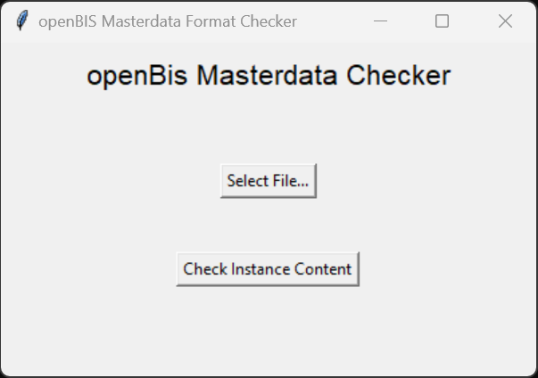
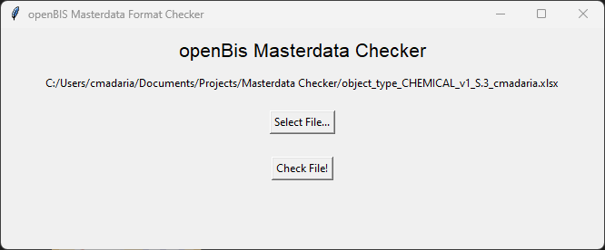
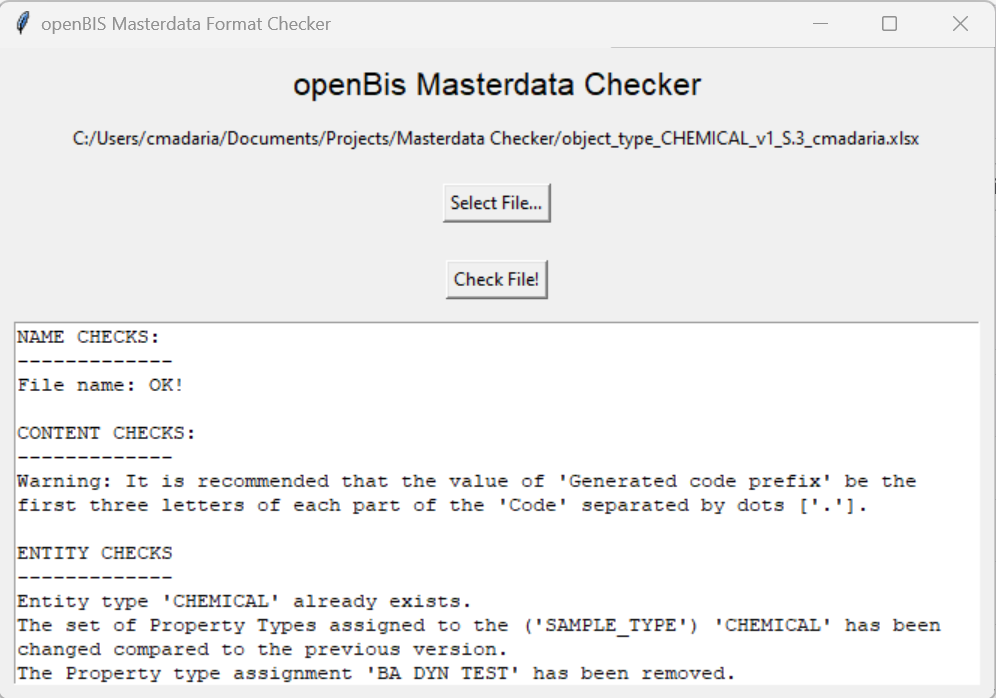
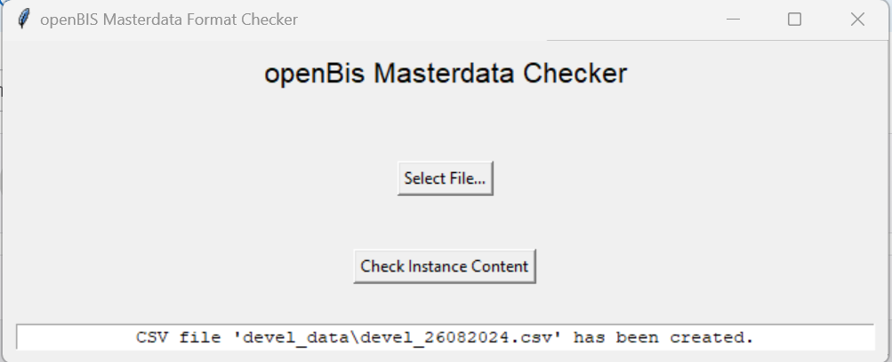
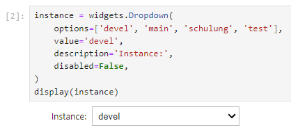
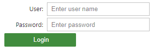
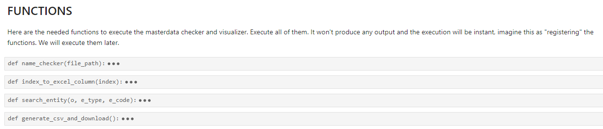
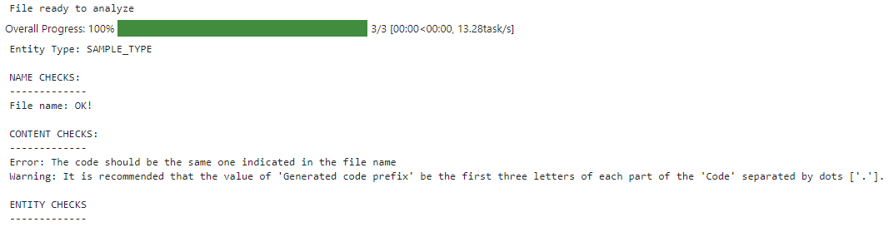
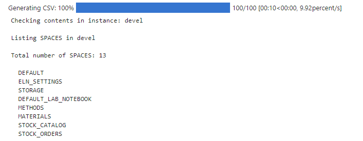

# Masterdata Checker & Visualizer

The Masterdata checker was developed to support Data Store Stewards and the Data Store Team in checking the conformity of openBIS Masterdata Entity Types (Object, Collection and Dataset Types) with the [‘Best Practices for Masterdata Definition’](https://datastore.bam.de/en/datastore/stewards/masterdata-best-practices#best-practices-for-masterdata-definition) as defined for the BAM Data Store.

The Masterdata Visualizer lists all Masterdata elements (Entity, Controlled Vocabularies and Property -Types).  The access rights that users have for using a Data Store instance apply for checking and visualising the Masterdata with these tools.

There are two alternatives for using these tools, which are explained in more detail below: 
1. Using the local application
2. Using the Jupyter Notebook Web IDE

These alternatives for using the tools are offered for users who are familiar with the command line or not. The Jupyter Notebook supports users who are not familiar with the command line.

## Requirements

Both alternatives 1. Local application and 2. Jupyter Notebook Web IDE have following requirements (I and II): 

I. **Python**: Install the latest version of Python:
([Python3](https://www.python.org/downloads/))

II. **Install dependencies**: These are required Python packages.  Once you have installed the latest Python version, you can use the ``pip`` command to install the dependencies (both in the command line (cmd) and in the Jupyter Notebook):

- pyBIS: ``pip install pybis``
- pandas: ``pip install pandas``
- regex: ``pip install re``

Additional packages are automatically installed with the version Python3. In case that you are using an older Python version, make sure to install following Python packages as follows:

1. *Using the local Application*
- TKInter: ``pip install tkinter``
- OpenPyXL: ``pip install openpyxl``

2. *Using the Jupyer Notebook Web IDE*:
- Install [Jupyter](https://jupyter.org/install) (if it is not present already in your system) using one of the following commands: ``pip install jupyterlab`` // ``pip install notebook`` . Information about the differences between both of them can be found [here](https://domino.ai/data-science-dictionary/jupyter-notebook).
- CSV: ``pip install csv``
- OS: ``pip install os``
- Python Widgets: ``pip install ipywidgets``
- Time: ``pip install time``
- Tempfile: ``pip install tempfile``

## Installation
Once that you have fulfilled all the requirements above, no more installation is needed, you can just run the main script to start using it. Follow the next section (*Usage*) to use the tool

## Usage

1. *Using the Local Application*:
    - First, clone or download the repository code (and unzip it in case is compressed).
    - Then, go to the main project folder an run the following command in the command line: ``python masterdata_checker.py "username" "instancename"``
    - Your password for that user and instance will be asked.
    - Once introduced, the interface will open.
    - Results will be saved where the project is located locally in the computer, in a folder called *data_'instancename'* (explained in the examples below).

2. *From Jupyter Notebooks*:
    - To use the notebook version, downloading the Jupyter Notebook from the Git repository and save it locally is enough (located in *jupyter_checker/checker_jupyter.ipynb*), there is no need to download the rest of the files in the repository.
    - Type and execute the following command in the command line: ``jupyter-notebook`` ( or ``jupyter-lab``, depending on the tool installed)
    - A window in the browser should open with the Jupyter enviroment displaying the folder structure of your computer. Open the *checker_jupyter.ipynb* by double clicking the jupyter Notebook saved locally in your computer.
    - Results will be saved where the Jupyter Notebook is located locally in the computer, in a folder called *data_'instancename'* (explained in the examples below).

### Local Application: Checking a file

1- Inside the main project folder, run the following in the command line (cmd): ``python masterdata_checker.py "username" "instancename"``, where you will need to replace "username" by your username in openBIS (for example, johndoe), and "instancename" by the name o the intance where you want to work with (for example, main).

2- A prompt will appear asking for your password for the introduced username in the indicated instance. The password will not appear meanwhile you write it, to keep it private, but as soon as you are finish, click Enter, and if al the data is correct, the GUI will follow.

3- This interface will appear, click on "Select File...".

4- A File Explorer window will appear, select the desired file and click on "Open".

5- Now, click on "Check File!", and wait a few seconds, until a text field with all the instance information appear.

### Local Application: Visualizing instance content

1- Inside the main project folder, run the following in the command line (cmd): ``python masterdata_checker.py "username" "instancename"``, where you will need to replace "username" by your username in openBIS (for example, johndoe), and "instancename" by the name o the intance where you want to work with (for example, main).

2- A prompt will appear asking for your password for the introduced username in the indicated instance. The password will not appear meanwhile you write it, to keep it private, but as soon as you are finish, click Enter, and if al the data is correct, the GUI will follow.

3- This interface will appear, click on ""Check Instance Content".

4- Now wait a few seconds, until a message indicating that a CSV file was created. This file will be located in the same location where you are executing the script, with name of the instance, an underscore "_", and the day of execution. It will contain all the instance Masterdata information (types for every entity, object properties by type, ...) 

### Jupyter Notebook Web IDE

1- Run ``jupyter-lab`` or ``jupyter-notebook`` on the folder where the jupyter_checker is located, using the command line (depending on what you have installed).

2- On the left side, select the file *checker_jupyter.ipynb*, and double click to open it.

3- Once the notebook is open, execute the first code cells: the one containing all the imports, and then the cell for selecting the openBIS instance. A dropdown list will appear containing all the available openBIS instances; select the desired one.

4- Then, run the cell for entering username and password. Two text fields for entering this information and a button called "Login" should appear. Enter your information and click on it. If everything went well, you will see "Login sucessful!".

***NOTE***: You will see another cell below the login tool, execute it just if the login fails for any reason using the login tool. It will take the username and password entered in the login tool, and do the login manually by script instead of using the button (that sometimes can fail).

5- Now you will see the "FUNCTIONS" section. Here, you should execute all the cells that you can see (the cells will be collapsed, but you can extend them if you want just clicking on them), because there are the functions for the checker and visualizer. Run all the cell codes until you get to the section "USE THE CHECKER".

6- (Just follow this step and the next one in case that you want to use the Masterdata Checker. In case that you want to execute the Visualizer, go directly to step 8). Execute the cell that goes after "UPLOAD THE EXCEL FILE". An *Upload* button will appear. Click on it, and upload the Excel file with the entity where you want to check the Masterdata.

7- Finally, using the next cell will run the checker. A loading bar will appear with the different procesess, and once that it finishes, all the checks will appear below.

8- For running the Visualizer, steps 6 and 7 are not needed. Just run the cell below the section "USE THE VISUALIZER", and you will see a loading bar. When it finishes, you will see the instance content (in Masterdata terms), and together with it, a CSV file will be generated in the same location of the notebook, in a folder determined by the instance, named with instace and generation date. Example directory and file name: *devel_data/devel_28082024*.

## Support
Carlos Madariaga: carlos.madariaga@bam.de
Jörg Radler: joerg.raedler@bam.de
Angela Ariza: angela.ariza@bam.de